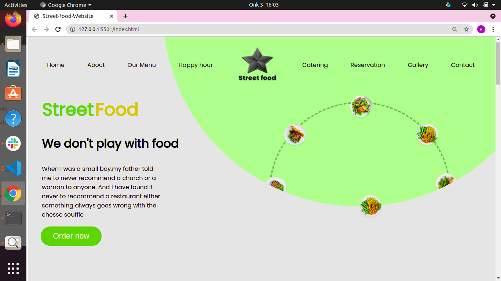

# Street food Website
##### By Ruweydha Abdinoor
### It is a street food website.
## Table of Content
+ [Description](#description)
+ [Installation Requirement](#Installation)
+ [Technology Used](#technology-used)
+ [Reference](#reference)
+ [License](#license)
+ [Authors Info](#author-Info)
​
## Description

This is a street food website. It is a simple website with a home page, an explore menu, a ot deals page, a contact us page and a footer with the socials of the company and address.

This is how the home page looks like.

## Installation
​​This application for now only works on a web browser hence no installation is required.
### Requirements

* Either a computer,phone,tablet or an Ipad

* An access to the Internet
## Technology Used
* HTML - which was used to build the structure of the pages.
​
* CSS - which was used to style the all the pages of the website.
​
## Reference
* Materialize CSS
​
## License
​
MIT License
Copyright (c) [2021] [Ruweydha Abdinoor]
​

## Authors Info
​
github - [Ruweydha Abdinoor](https://github.com/Ruweydha)
​